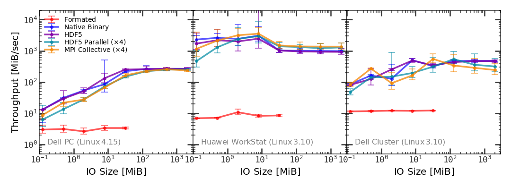
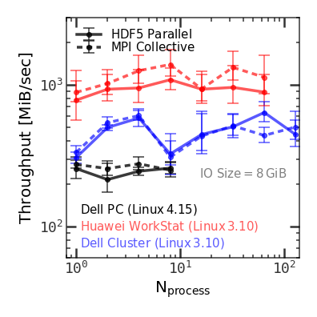
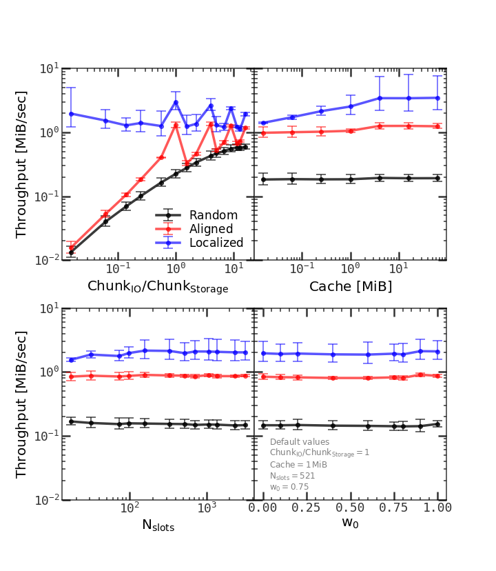

# Lab: IO with HDF5

[Back to home](https://github.com/ChenYangyao/N-Body-Course) | [View Jupyter](./out/perf_measure.ipynb) | [View pdf images](./out) | View source code [using-hdf5](./src_learn_hdf5) and [timing-the-IO](./src)

## Introduction

HDF5 is a file format, a data organization/access model, and also a suite of software.

- The file format of HDF5 is stanadarized by `HDF5 File Format Specification`. 
It specifies the bit-level storage layout of data, and hides many details that is unnecessarily exposed to user.

- The `HDF5 Abstract Data Model` specify the building blocks of HDF5 file - the HDF5 object. Two primary objects in HDF5 is group and dataset.

- The HDF5 community provide a complete set of softwares and language interfaces. 
C, C++, Fortran, Python and Java users can all use HDF5 to manipulate the same data file.

The download and documentation can be found at HDF group [home page](https://portal.hdfgroup.org/display/support/Documentation?utm_source=hdfhomepage).

## Lab - creating, reading and working with HDF5

As an example of manipulating dataset using HDF5, I transform a existed dark matter halo catalog in a [N-body simulation](http://stacks.iop.org/0004-637X/831/i=2/a=164?key=crossref.7263525aa9855196b4f2f603a9360323), which is dumped in a platform-dependent binary format, into a HDF5 file. The design of the content organization is
```bash
/root [G]
  |- cosmology [G]              # The cosmology information used in the simulation
  |     |- redshift [D]         #   including the redshift, scale factor and cosmic 
  |     |- cosmic-time [D]      #   time of each snapshot
  |     |- scale-factor [D]
  |- halos [G]
  |     |- halo-mass [D]        # The halo catalog, including halo mass, virial radius,
  |     |- rvir [D]             #   coordinates (x, y, z) and most bound particle ID
  |     |- x [D]                #   of each halo.
  |     |- y [D]                
  |     |- z [D]              
  |     |- bound-id [D]
  |- galaxies [G]               # The galaxy catalog, including stellar mass and
        |- stellar-mass [D]     # star formation rate of each galaxy. The galaxies
        |- SFR [D]              # are modelled by an empirical model.
```
where the item with [G] means a HDF5 group, and [D] means a dataset. Such a design is natural:
- The cosmology, halos, and galaxies are three distinct parts of this simulation. So
we should use different groups to represent them

- At each group, we have many physical quantities of the objects in this group, e.g. halos or
galaxies. So we use a dataset to describe each of these quantities.

- For each dataset, we have an attribute named 'description' which is a string of HDF5
type `H5T_C_S1` (resized to proper length). We use this string to record some information
about this quantity, including its formal name, and unit.

We may use `h5ls -r` to check this catalog. In the shell, it outputs such information
```bash
/                        Group
/cosmology               Group
/cosmology/cosmic-time   Dataset {101}
/cosmology/redshift      Dataset {101}
/cosmology/scale-factor  Dataset {101}
/galaxies                Group
/galaxies/SFR            Dataset {1001}
/galaxies/stellar-mass   Dataset {1001}
/halos                   Group
/halos/bound-id          Dataset {1001}
/halos/halo-mass         Dataset {1001}
/halos/rvir              Dataset {1001}
/halos/x                 Dataset {1001}
/halos/y                 Dataset {1001}
/halos/z                 Dataset {1001}
```
which is exactly what we want. We can also use `h5dump -H`, this time, it outputs the header information of each object in the file (in a format call HDF5 DDL):
```bash
HDF5 "Obj.EmpiricalModel.N3072.L500" {
GROUP "/" {
   GROUP "cosmology" {
      DATASET "cosmic-time" {
         DATATYPE  H5T_IEEE_F64LE
         DATASPACE  SIMPLE { ( 101 ) / ( 101 ) }
         ATTRIBUTE "description" {
            DATATYPE  H5T_STRING {
               STRSIZE 20;
               STRPAD H5T_STR_NULLTERM;
               CSET H5T_CSET_ASCII;
               CTYPE H5T_C_S1;
            }
            DATASPACE  SIMPLE { ( 1 ) / ( 1 ) }
         }
      }
      DATASET "redshift" {
... ...
```


## Lab - Timing the IO with Different Tools

The main motivation of using HDF5 is performance and portablity. A programming language like 
C/C++ or Fortran typically provides both formated IO tools and the binary IO tools. Both of
them have short-commings:

- The formated IO, such as `printf/fprintf/sprintf/snprintf/...` (and their input counterpart) provided by C library, 
or `ostream::operator<<` (and its input counterpart) provided by C++ standard library, is extremely slow when the IO size 
is large. The reason of slow-down is due to the conversion between human-readable format and 
the machine-readable format. Another issue is the loss of precision of floating-point number, 
which in many cases makes the effort of computer architecture desingners vanished.

- The binary IO, such as `fwrite/fread` or `ostream::write/istream::read`, is very fast. But the problem
is that the binary format is platform-dependent. For example, the endian (big/little/PDP/...) and floating-point 
representation (IEEE-754/IBM/Hewlett-Packard/PDP/...) may vary from platform to another.

HDF5 tries to solve these problems by creating a self-explanatory file format. The file and object heads in 
the HDF5 file provide descriptions of the data representation and layout, the library tools are 
provided to convert them with native representation at different platforms. The conversion and the overhead
introduced by the data organization may cause some performance loss, and therefore need to be tested.

Many other things also have impact on the IO performance. The disk design, including disk-type, 
seek/rotation/throughput, disk cache layout and size, and its interface with memory and processor,
may change the IO speed by orders of magnitude. The operating system file system, IO buffer, scheduling
may also contribute to the performance. Therefore, we may also need to test the IO performance at 
different platforms, to see how the hardware and system software condition may change the IO.

`Figure 1` shows the IO performance tests with five different tools and on three totally different 
platforms, with different IO sizes. 

- The interesting thing is that in our personal computer, the 
IO throughput for all binary IO (Native binary, HDF5, HDF5 parallel version and MPI IO)
changes with IO size: large data have better IO performance, and the upper limit is about 300 MiB/sec 
when the data set size exceed several tens MiB. In the Workstation and Cluster, the change of 
binary performance on IO size is not obvious, but their performances are always better than the PC.

- Another thing is that the the formated IO performances 
on all platforms are really stable, with almost no change on different IO size, but they slower 
than the binary IO by 1 or more order of magnitude. 

- The final things is that, the parallel IOs with 4 processes shows little improvement of performance.
The reason is not clear now.

In one word, the IO performance obviously varies in different platfroms. But in all cases, the 
HDF5 IO shows little overhead compared with native binary IO. 

<table><tr>
    <td></td></tr><tr>
    <td><em>Figure 1: The IO performance of different IO tools. </em><br> 
        IOs are performed with five different IO tools: the formated IO in C++ 
        standard library &lt;iostream&gt;, the native binary IO in 
        &lt;iostream&gt;, HDF5, HDF5 parallel version, and MPI collective IO with 
        disjoint file views. Three panels are tests performed on three different 
        platforms: a DELL PC, a Huawei Workstation and a DELL cluster. At each panel 
        we perform IO of contiguous data with size indicated in the x-axis.
    </td>
</tr></table>

Parallelism may help IO, if the underlying hardware and operating system support it. At version 2.0 
or later, MPI support parallel IO by `MPI_File_*` subroutines. Users may use the file view and parallel
collective IO provided by MPI to lift the IO performance on a single file. HDF5 also provide the MPI 
parallel version, called the Parallel HDF5 (PHDF5, see the
[official doc](https://portal.hdfgroup.org/display/HDF5/Introduction+to+Parallel+HDF5) for an introduction).

Figure 2 shows the performance of IO on three different platforms with either directly using MPI IO subroutines 
or with PHDF5 interface. The result is really surprising. In the local PC and Huawei Workstation system, 
the parallel version shows almost no speed up, maybe because their hardware or system software does not 
support it. On the DELL cluster, the performance curve is not monotonic, at some parallel level you 
get better performance.

<table><tr>
    <td></td>
    <td width="300"><em>Figure 2: The IO performance with different number of processes. </em><br> 
        We perform IO of 8 GiB contiguous data with two different tools: the HDF5 parallel 
        version, the MPI collective IO with disjoint file views. For each tool, different 
        number of processes are used to test performances. The test are performed on 
        three different platforms: a DELL PC, a Huawei Workstation and a DELL cluster.
    </td>
</tr></table>

One more issue is the data layout on the disk. By default HDF5 use a contiguous data layout, 
row-major in C. But it is also possible to use chunked data layout. This is necessary to unlimit-size 
data set or compressed data storage, and it may also provide benefit is you want to just visit 
a subset of the whole dataset. See the [dev guide](https://portal.hdfgroup.org/display/HDF5/Chunking+in+HDF5) 
for detail of chunking layout. The performance of chunking may depend on the following factors:

- Size of chunk. A too small size chunk may cause the IO need many times of disk-visiting. A too large size
chunk may introduce overhead if you just want to visit a small subset of data, and it also increase the cache 
miss rate. 

- Cache. The cache of chunked dataset is controlled by three parameters: the cache size, the size of
hash table which is used to record which chunk is in the memory and the location of it, and the chunk 
swap policy parameter, which controlls which chunks is swapped-out when the cache is full.

Another factor that has impact on the IO performance of chunked dataset is the visiting policy - that is,
at each access time which subset of data is selected. To mimic the real application, we design three 
different visiting policies, where we assume all the datasets,
chunks and accessed subset are 2-d square with fixed sizes:

- The random visiting: the location of sub-dataset is uniformly, randomly picked in the whole dataset.

- The aligned visiting: same as ramdom visiting, but we required the starting point of the sub-dataset 
is aligned with the boundary of the storage chunk.

- The localized visiting: same as random visiting, but at each visiting the ramdom position must 
near the sub-dataset visited last time. This is like a 2-d ramdom walk.

Figure 3 shows the performance measurement for different chunking parameters and different visiting policies. 
The most important factor that determines the IO speed is the size ratio between data requested and 
the storage chunk size. The cache size also affect the performance, but the effect is small. Other two 
chunking parameters have little impact. Also, the visiting policy seems large affecting the IO performance.
The ramdom visiting, as expected, give the worst performance. If the visiting has some constraints, e.g.,
aligned or localized, the performance will be much better. Also, the chunk size needs to be carefully
selected, which may be seen from the first panel where some local peaks appeared at the curves.

<table><tr>
    <td></td>
    <td width="300"><em>Figure 3: The IO performance of HDF5 with chunk data-layout. </em><br> 
        We perform IO of many "Chunk_IO"-size chunks, 
        on a 128 MiB dataset with "Chunk_Storage=8 KiB" storage chunks. 
        The default data access parameters, including the IO chunk size, cache size, 
        cache hash table slot number, and cache LRU scheduling parameter "w_0", 
        are listed on the lower-right panel.
        In each panel, one data access parameter is adjusted and the IO thoughtput
        is measured with different parameter values. All these test is done on 
        the local DELL PC with Linux Kernel Version 4.15. In each case we use 
        three different data visiting policies to select which subset of data is visited.
    </td>
</tr></table>
