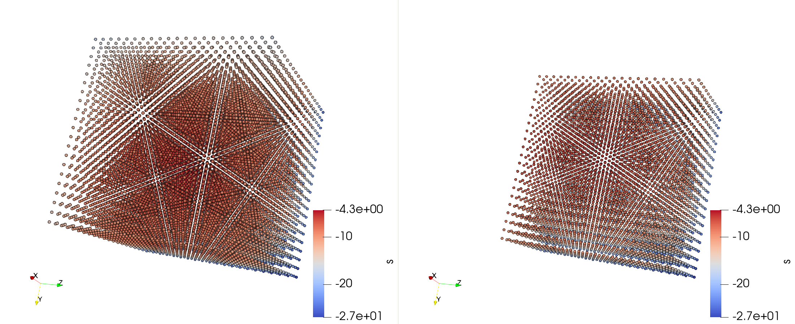
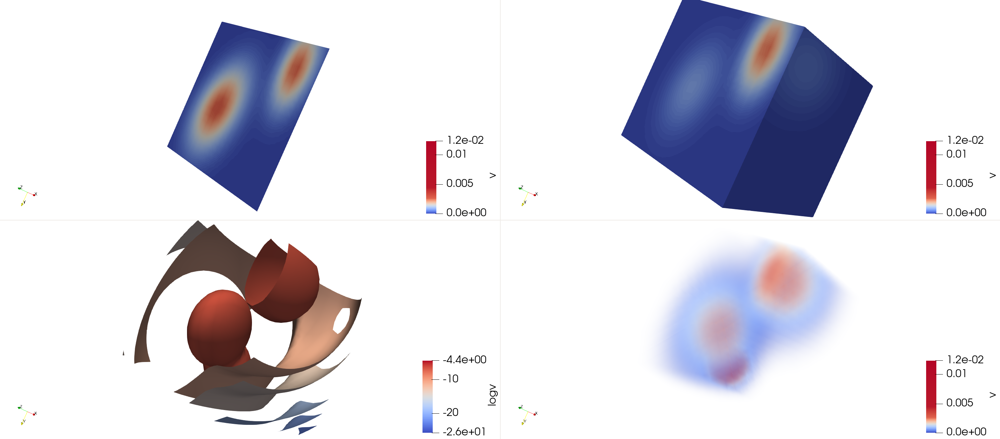

# Lab: Scientific Visualization with Paraview

[Back to home](https://github.com/ChenYangyao/N-Body-Course) | [View Jupyter](./out/perf_measure.ipynb) | [View pdf images](./out)

## Introduction

[Paraview](https://www.paraview.org/) is a software stack for scientific visualization. Paraview is based on VTK, but provide user-friendly GUI and python script system that help users to easily handle their visualization task.

The [download](https://www.paraview.org/download/), [tutorial](https://www.paraview.org/tutorials/) and [user's guide](https://www.paraview.org/paraview-guide) are valuable learning resources, all of which can be found at the official website.

## Different Types of Rendering

The workflow of paraview includes importing data, feature extraction (by filters and the building of pipeline) and rendering the graphics. Paraview provide different types of visualization rendering, such as spatial points, surface, volume, etc. Here we try different renders to the same data set consisting of 3-D spatial grids with three-component Gaussian functions evaluated at these grids. The code that generates these grids can be found in the [Jupyter notebook](./out/perf_measure.ipynb).

We first try the pointer rendering. Figure 1 shows the graphics obtained by displaying the grids with 3-d `Points`, with default color coding. We also make a partition of the space so that you may see the an internal slice of the grids, and this is shown in the right panel. It is clear that the Point render is not suitbale for displaying so dense grids.

<table><tr>
    <td></td></tr><tr>
    <td><em>Figure 1: Display the 3-D grids with Points.</em>  
    Left panel: the whole Box. Right panel: half of the box after partition the space, so that you can see an internal slice of the grids. </td>
</tr></table>

Then we try other renderings. Thses are shown in the Figure 2. In the top-right panel you see a `Surface` representation, where now you can see two Gaussian components. In the top-left panel a make a slide of the surface rendering, so that you can see the internal structure in the grids, which again has two Gaussian components. Then in the bottom-left panel you see the `Contours`. Finally at the bottom-right panels we use a `Volume` representaion. Now all the three Gaussian components can be seen.

<table><tr>
    <td></td></tr><tr>
    <td><em>Figure 2: Surface and Volume representation, with Slice and Contours filters. </em>  
        Top-left: a slice of the Surface rendering. Top-right: the Surface rendering. Bottom-left: the contours filter. Bottom-right: the Volume rendering. </td>
</tr></table>

## Animation: Some Astroph and Mathematical Examples

In paraview you can make animations by displaying different objects at different time steps, or you can change the position of the camera to let the observers moving, or you may make a combination of two.

In the first example below, we show the visualization of real scientific data from a N-body simulation [ELUCID]((http://stacks.iop.org/0004-637X/831/i=2/a=164?key=crossref.7263525aa9855196b4f2f603a9360323)). Since the data is huge so we only select a 40x40x40 Mpc/h sub-block of the simulation box, where we use 100x100x100 grids to extract density from it with standard `cloud-in-cell (CIC)` mass-assignment scheme. In the Figure 3, the left panel shows the surface of such a sub-box, where the color is coded according to the density at grids. The large scale structures are easily seen from the figure. But due to the limit of my PC, the resolution is not very high to resolve more subtile structures. The right panel shows the `Iso-volumn` of some high density regions, where you may see some node-like structure where massive galaxy cluster may form. We also make a [short movie](./out/elucis_mesh_N100_L39.avi) by rotating the camera.

<table><tr>
    <td></td></tr><tr>
    <td><em>Figure 3: The density field of a N-body simulation. </em>  
        The density field on the surface of a 40x40x40 Mpc/h box is shown in the left panel, where we use 100x100x100 grids to extract the density field. The iso-volume filter applied to these grids is shown in the right panel, where some high-density node-like structures can be seen. [ Download the <a href="./out/elucis_mesh_N100_L39.gif">GIF</a> or <a href="./out/elucis_mesh_N100_L39.avi">AVI</a> animation ]
    </td>
</tr></table>

Finally we animate a interesting mathematical model call game of life or cellular automaton [wikipedia](https://en.wikipedia.org/wiki/Cellular_automaton). Originally a game of life is made in 2-d space, like the following Figure 4.

<table><tr>
    <td></td>
    <td width="250"><em>Figure 4: 2-d Game of life.</em> 
    Downloaded from <a href="https://en.wikipedia.org/wiki/Cellular_automaton">wikipedia</a>.
    </td>
</tr></table>

Now we turn to the 3-d case ( following [Carter Bays, 1987](https://wpmedia.wolfram.com/uploads/sites/13/2018/02/01-3-1.pdf) ). The code generating the population can be found at the [Jupyter notebook](./out/Lab.ipynb) The Figure 5 shows the 3-D grids and a slice of the game of life. 

<table><tr>
    <td></td></tr><tr>
    <td><em>Figure 5: The 3-d game of life </em>  
        Left: 3-d grids of the popolation in the game. Right: a 2-d slice. Color is coded by the count of living neighbor of each grid. [ Download the <a href="./out/game_of_life_N40_Rule5866.gif">GIF</a> or <a href="./out/game_of_life_N40_Rule5866.avi">AVI</a> animation ]
    </td>
</tr></table>