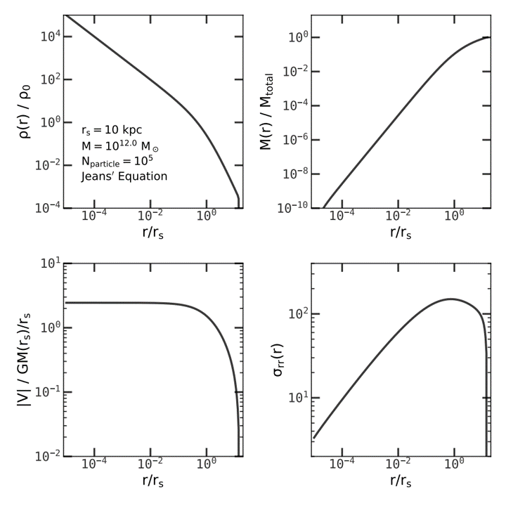
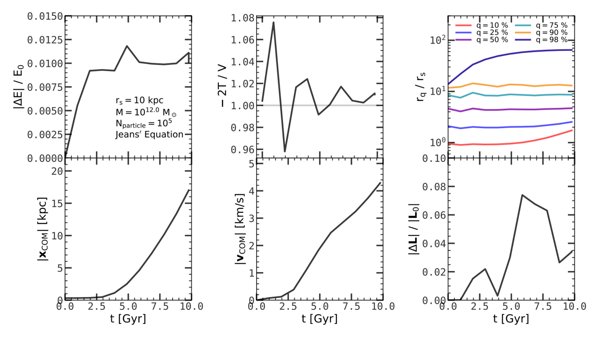
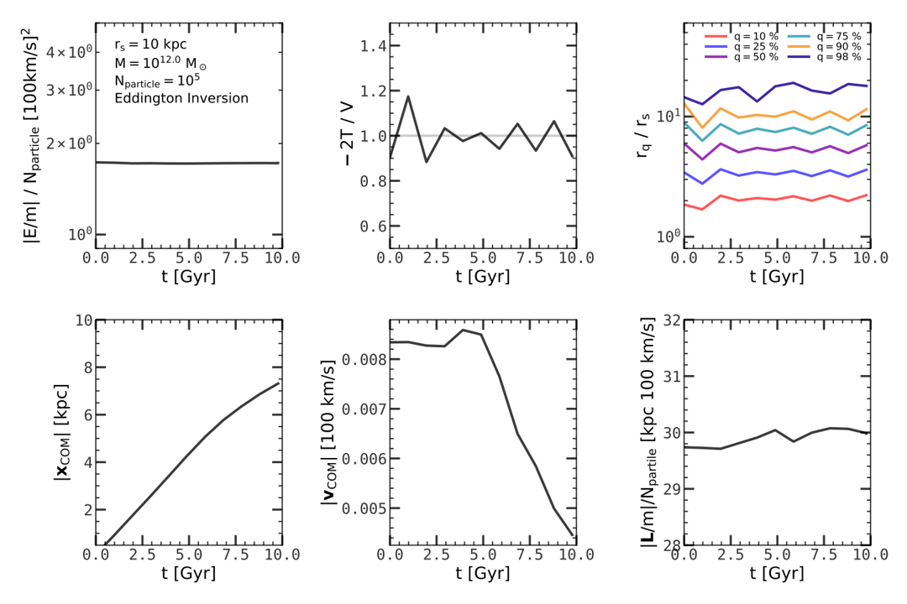

# Lab: Generate Initial Conditions

[Back to home](https://github.com/ChenYangyao/N-Body-Course) | [View Jupyter](./wdir/InitialCondition.ipynb)

## Introduction

The first step to perform a N-body simulation is to generate an initial condition (IC). Here we consider the simplest case, the initial condition of a collisionless, spherical symmetric system in equilibrium. As introduced in Ch4 of [Binney & Tremaine](https://press.princeton.edu/books/paperback/9780691130279/galactic-dynamics), this type of system must have the following properties

- The distribution function `f` depends only on the Hamiltonian `H` (ergodic), which means the velocity dispertion tensor is isotropic at any point.
- The Eddington inversion can be applied to obtain the exact distribution function `f`.
- The solution of Boltzmann equation must be a motion integration, since the system is in equilibrium.

These statements simplify the IC generation.

In the following we test generating IC with (1) Jeans' Equation, which uses a exact position distribution and a approxiamte Gaussian velocity distribution with velocity dispertion calculated from Jeans' Equation, and (2) Eddington Inversion, which gives the exact distribution in phase space.

Since we observed that momentum of the system is not conserved ( tree algorithm does not conserve the momentum. [See Dehnen W. 2000](https://arxiv.org/abs/astro-ph/0003209) for a improvement using Fast Tree Code which conserves the momentum exactly ).

## Initial Conditions with Jeans' Equation

We first need assume a halo profile (because the solution of steady Boltzmann equation is not unique). A common choice is assume a NFW profile which is obtained from cosmological simulation and used widely in simulations at different scales. We therefore assume a NFW profile with r_s = 10 kpc, M = 10^12 Msun (a Milky-way-like galaxy system). Here for numerical convenience, we truncate the profile at r_t = 150 kpc, with width = r_s erf function. To be numerically efficient, mass - r relation and sigma - r relation is interpolated with equally spaced ln r by cubic spline. 

The results of rho - r, M - r, V - r and sigma - r relations in the above assumption are shown in the Figure 1. Thanks for the 

<table><tr>
    <td></td><td width="250"><em>
    Figure 1: The initial condition by Jeans' Equation.
    </em> 
    Upper left, upper right, lower left, lower right panels show the density profile, enclosed-mass profile, potential profile and velocity dispersion profile. Here we assume a Milky-way-like galaxy system with total mass M = 10^12 Msun, characteristic scale rs = 10 kpc. The density profile is assumed the NFW profile with an erf truncation at r = 150 kpc.
    </td></tr></table>

<table><tr>
    <td></td></tr>
    <tr><td><em>Figure 2: Statistics of particle system after running the N-body code with Jeans' Equation IC.
    </em> 
    10^5 particles are used to trace the phase space distribution. The system is evolved under the Newtonian gravity from t = 0 to t = 10 Gyr and 12 snapshots is dumped. The relative change of total energy, the virial ratio -2T/V, the quantile radii of particles, the position and velocity of center of mass, and the relative change of the angular momentum are shown at different time steps.
    </td></tr></table>

<table><tr>
    <td></td></tr>
    <tr><td><em>Figure 3: Statistics of particle system after running the N-body code with Eddington Inversion IC.
    </em> 
    10^5 particles are used to trace the phase space distribution. The system is evolved under the Newtonian gravity from t = 0 to t = 10 Gyr and 12 snapshots is dumped. The relative change of total energy, the virial ratio -2T/V, the quantile radii of particles, the position and velocity of center of mass, and the relative change of the angular momentum are shown at different time steps.
    </td></tr></table>

<table><tr>
    <td></td></tr>
    <tr><td><em> Figure 4: Effect of changing opening criteria.
    </em> 
    50000 particles are used by Jeans' Equation to generate the ICs. For each different value of opening criteria 'alpha', we generate 10 random ICs. Gadget-2 code is run on these ICs from t = 0 to t = 5 Gyr, and the CPU hours, move of center of mass, and the change of the velocity of center of mass is measured. Here we assume a Milky-way-like galaxy with mass M = 10^12 Msun, 10 kpc characteristic scale and erf truncated at 150 kpc.
    </td></tr></table>

