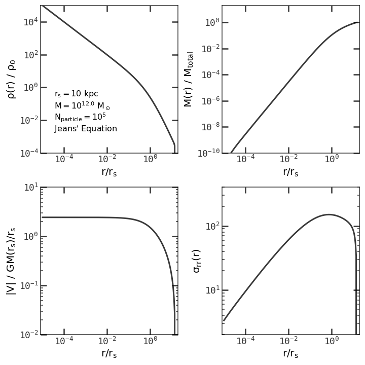
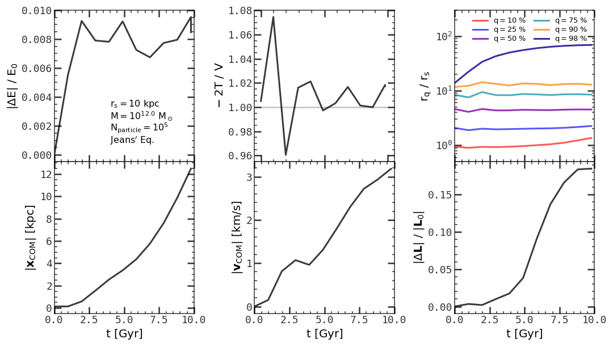
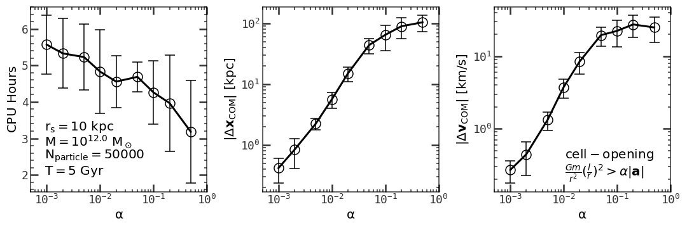
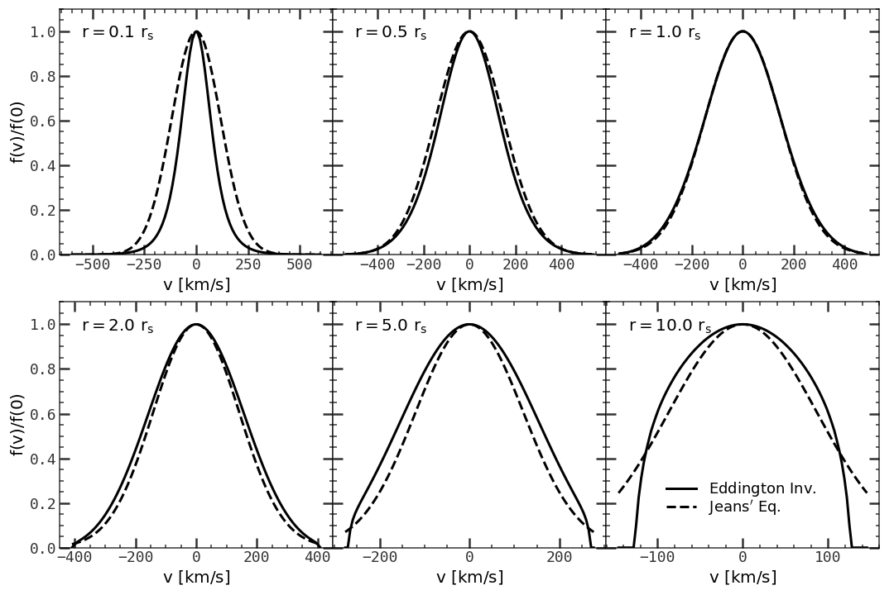
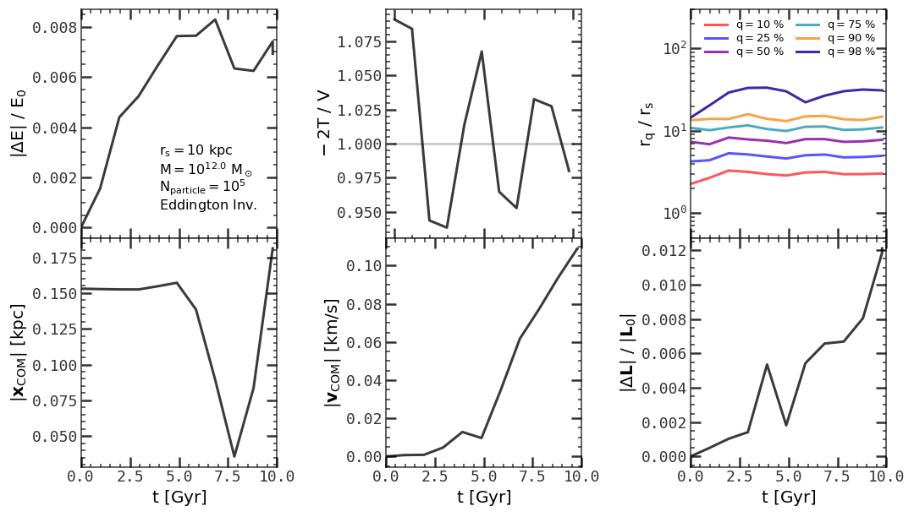

# Lab: Generate Initial Conditions

[Back to home](https://github.com/ChenYangyao/N-Body-Course) | [View Jupyter](./wdir/InitialCondition.ipynb)

## Introduction

The first step to perform a N-body simulation is to generate an initial condition (IC). Here we consider the simplest case, the initial condition of a collisionless, spherical symmetric system in equilibrium. As introduced in Ch4 of [Binney & Tremaine](https://press.princeton.edu/books/paperback/9780691130279/galactic-dynamics), this type of system must have the following properties

- The distribution function `f` depends only on the Hamiltonian `H` (ergodic), which means the velocity dispersion tensor is isotropic at any point.
- The Eddington inversion can be applied to obtain the exact distribution function `f`.
- The solution of Boltzmann equation must be a motion integration, since the system is in equilibrium.

These statements simplify the IC generation.

In the following we test generating IC with (1) Jeans' Equation, which uses a exact position distribution and a approximate Gaussian velocity distribution with velocity dispersion calculated from Jeans' Equation, and (2) Eddington Inversion, which gives the exact distribution in phase space.

Since we observed that momentum of the system is not conserved ( tree algorithm does not conserve the momentum. [See Dehnen W. 2000](https://arxiv.org/abs/astro-ph/0003209) for a improvement using Fast Tree Code which conserves the momentum exactly ).

## Initial Conditions with Jeans' Equation

We first need assume a halo profile (because the solution of steady Boltzmann equation is not unique). A common choice is assume a NFW profile which is obtained from cosmological simulation and used widely in simulations at different scales. We therefore assume a NFW profile with r_s = 10 kpc, M = 10^12 Msun (a Milky-way-like galaxy system). Here for numerical convenience, we truncate the profile at r_t = 150 kpc, with width = r_s erf function. To be numerically efficient, mass - r relation and sigma - r relation is interpolated with equally spaced ln r by cubic spline using 1500 nodes. 

The results of rho - r, M - r, V - r and sigma - r relations in the above assumption are shown in the Figure 1. Here we see the curves are really smoothing, although all the physical quantities have very large dynamical range.

<table><tr>
    <td></td><td width="300"><em>
    Figure 1: The initial condition by Jeans' Equation.
    </em> 
    Upper left, upper right, lower left, lower right panels show the density profile, enclosed-mass profile, potential profile and velocity dispersion profile. Here we assume a Milky-way-like galaxy system with total mass M = 10^12 Msun, characteristic scale rs = 10 kpc. The density profile is assumed the NFW profile with an erf truncation at r = 150 kpc.
    </td></tr></table>

By Monte Carlo method, 10^5 particles are generated to represent the phase-space distribution functions. The resulted particles are treated as IC and put into the simulation. 10 Gyr evolution is traced and 13 snapshots are dumped. In the post-processing, the following quantities are calculated to check the goodness of IC and the Gadget-2 code

- Total energy E as a function of time. Since E in simulation should be conserved, we use (E - E0)/E0 to represent the energy change relative to its inital value E0.
- The virial ratio -2T/V. Here T is the kinetic energy and V is the potential energy. According to virial theory, a equilibrium system should have virial ratio ~ 1.
- The quantile radii (q=10%, 25%, 50%, 75%, 90%, 98%) relative to the center of mass for each particle.
- The position of the center of mass.
- The velocity of the center of mass.
- the angular momentum relative to the center of mass.

The time evolution of these 6 quantities are shown in the Figure 2. The energy seems to be conserved within 1 %. The virial theory is obeyed within 8 %. The quantile radii seem stable. Although the inner-most and outer-most curves are shifting outward, possibly due to the velocity distribution is not strictly Gaussian which is assumed by Jeans' approach. The center of mass seems not in the rest. It is moving and accelerated. This is because tree-code does not conserve momentum. The angular momentum also changes.

<table><tr>
    <td></td></tr>
    <tr><td><em>Figure 2: Statistics of particle system after running the N-body code with Jeans' Equation IC.
    </em> 
    10^5 particles are used to trace the phase space distribution. The system is evolved under the Newtonian gravity from t = 0 to t = 10 Gyr and 12 snapshots is dumped. The relative change of total energy, the virial ratio -2T/V, the quantile radii of particles, the position and velocity of center of mass, and the relative change of the angular momentum are shown at different time steps.
    </td></tr></table>

### Effect of Opening Criterion on Momentum Conservation
Direct force calculation should conserve the momentum with Leapfrog integration. The cell opening criterion in the tree code is then responsible for the break of momentum conservation. Here we run a set of simulations with different opening criterion parameter alpha. For each alpha, we calculate the CPU hours for 5 Gyr simulation, the move of the center of mass, and the change of the velocity of the center of mass. Results are shown in the Figure 3. Here we see the alpha-delta v relation is almost power-law for small alpha, and becomes flatten at larger alpha.

<table><tr>
    <td></td></tr>
    <tr><td><em> Figure 3: Effect of changing opening criteria.
    </em> 
    50000 particles are used by Jeans' Equation to generate the ICs. For each different value of opening criteria 'alpha', we generate 10 random ICs to calculate the error bar of statistics. Gadget-2 code is run on these ICs from t = 0 to t = 5 Gyr, and the CPU hours, move of center of mass, and the change of the velocity of center of mass is measured. Here we assume a Milky-way-like galaxy with mass M = 10^12 Msun, 10 kpc characteristic scale and erf truncated at 150 kpc.
    </td></tr></table>

## Initial Conditions with Eddington Inversion

For comparison, we also calculate the IC by Eddington Inversion. In principle the Eddington Inversion gives a precise result when the system is ergodic but Jeans' Equation does not. The problem is that in Jeans' Equation only velocity dispersion is derived, and the distribution is assumed to be Gaussian which is not always true.

Figure 4 shows a comparison of velocity dispersion generated by Eddington Inversion and Jeans' Equation. It is obvious that at very small radius and very large radius, the Jeans' Equation gives a bad approximation. At intermediate radius, the Gaussian condition is held.

<table><tr>
    <td></td></tr><tr><td>
    <em>
    Figure 4: Compare the velocity distribution function at different radius from Jeans' Equation and Eddington Inversion.
    </em> 
    Each panel shows the density distribution at a radius r. Solid lines are from Eddington Inversion. Dashed lines are from Jean's Equation.
    The density profile is assumed the NFW profile with halo mass 10^12 Msun, rs = 10 kpc and an erf truncation at r = 150 kpc.
    </td></tr></table>

As did in the Jeans' Equation, we use the 10^5 particles to trace the IC, and do the simulation using the same set of parameters. The result is shown in the Figure 4. The quality of this initial condition seems bad. I will check the implementation later to improve this.

<table><tr>
    <td></td></tr>
    <tr><td><em>Figure 5: Statistics of particle system after running the N-body code with Eddington Inversion IC.
    </em> 
    10^5 particles are used to trace the phase space distribution. The system is evolved under the Newtonian gravity from t = 0 to t = 10 Gyr and 12 snapshots is dumped. The relative change of total energy, the virial ratio -2T/V, the quantile radii of particles, the position and velocity of center of mass, and the relative change of the angular momentum are shown at different time steps.
    </td></tr></table>

