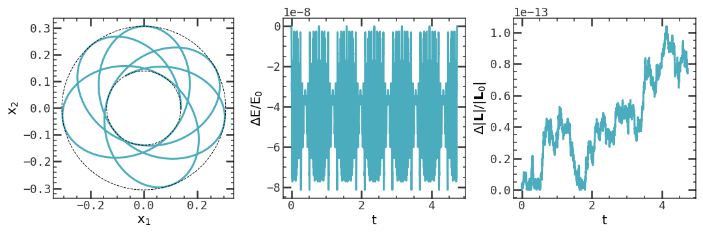
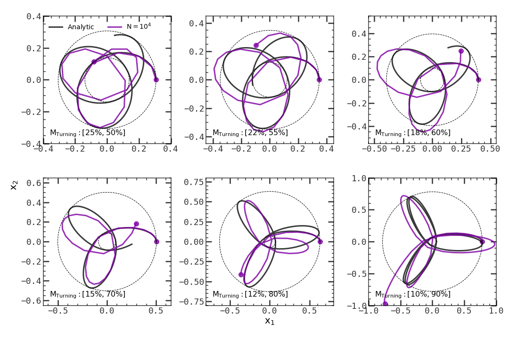
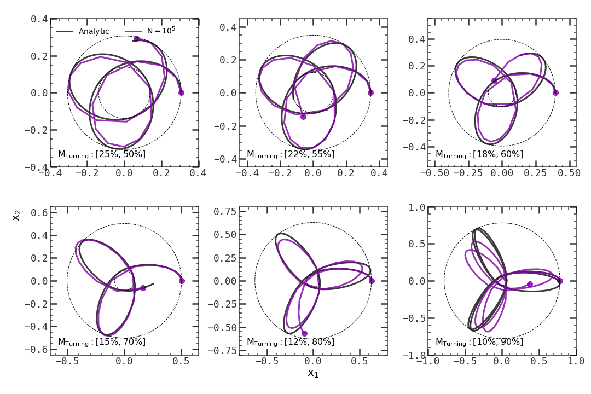
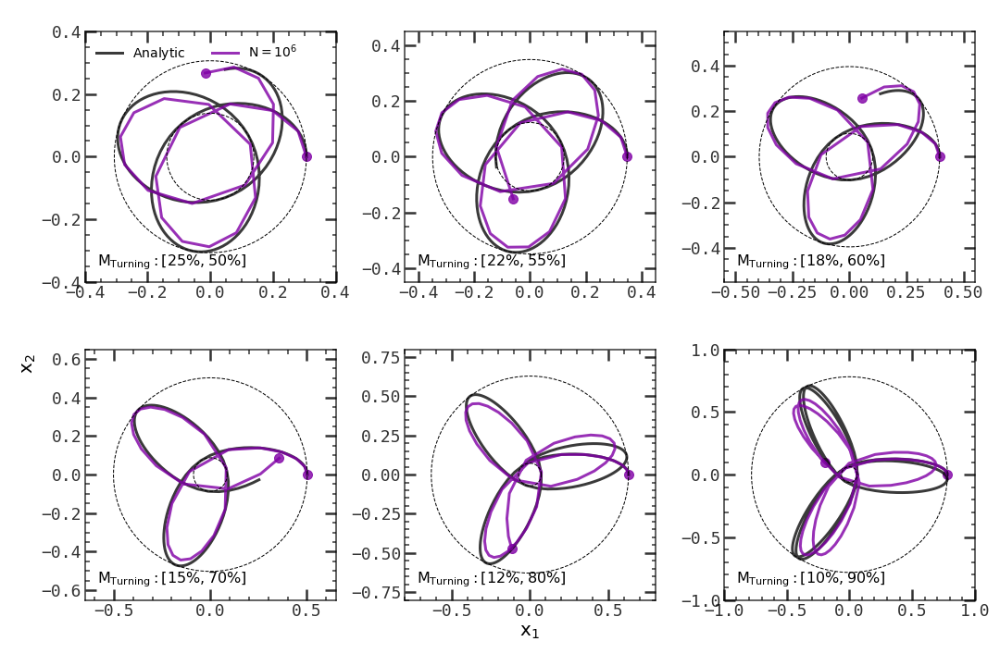
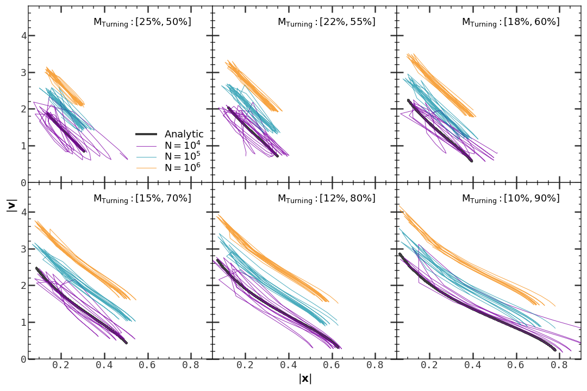
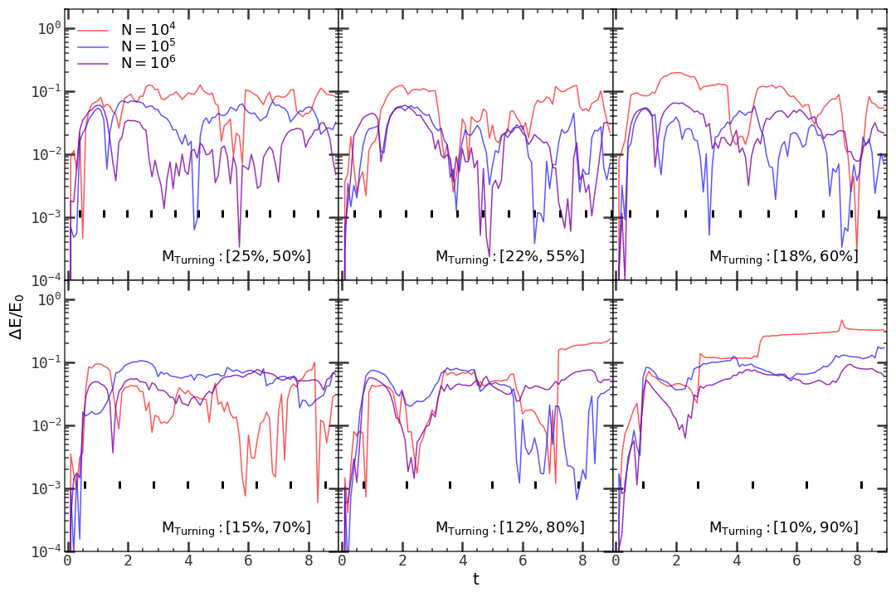
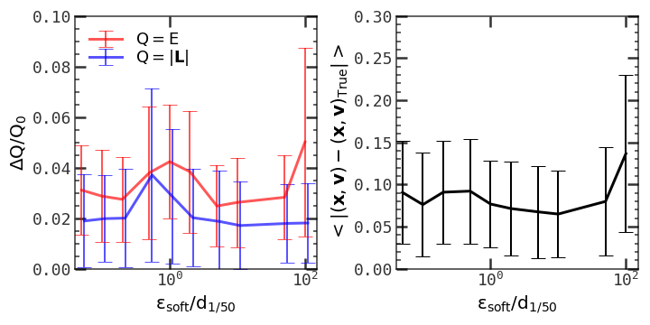
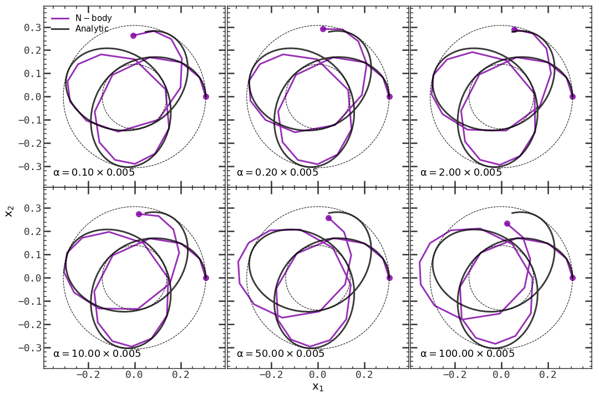
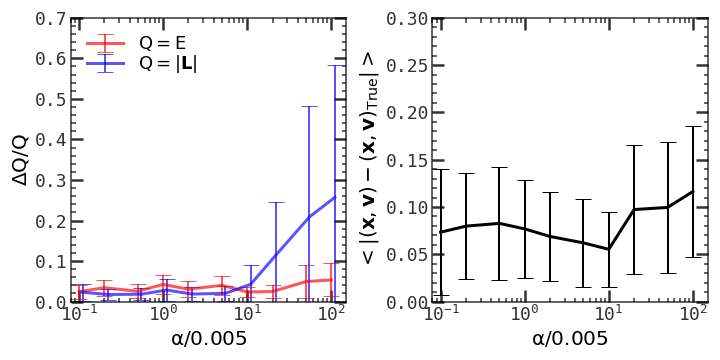

# Lab: Orbits of Particles

[Back to home](https://github.com/ChenYangyao/N-Body-Course) | [View Jupyter](./wdir/Orbit.ipynb)

In the [last lab](../week-7/README.md) I tried measuring the N-body simulation result by statistical quantities, e.g., the energy, angular momentum, percentile radii and virial ratio. An equally important measurement is the orbit of particles. In this lab I will present the results of particle orbits. The outline of this reports is
- Analytic orbit in spherical potential: I will use Leapfrog integration to calculate the orbit of particle in given potential field ([Binney & Tremaine, Section 3.4]((https://press.princeton.edu/books/paperback/9780691130279/galactic-dynamics))).
- Orbits in N-body simulation with different number of particles.
- The effect of other simulation parameters, i.e., the gravitational softening length, and the cell-opening parameter.

Things that have not been done yet include:
- Test the effect of time step size.
- Calculate the analytic orbit using action-angle variable. See [Binney & Tremaine, Section 3.5]((https://press.princeton.edu/books/paperback/9780691130279/galactic-dynamics)).

In this report all simulations are performed with the same suite of initial conditions. This is a Milky-way sized halo (M_vir = 10^12 M_sun, R_vir = 150 kpc, R_s = 10 kpc), truncated at R_vir using a erf function with width R_w = R_s. The initial conditions are generated with Jeans' Equation (see [Lab: Generate Initial Conditions](../week-7/README.md)).

To be consistent with other people, the unit system is set so that M_vir = R_vir = G = 1. The time unit in this system is 0.866 Gyr, the velocity unit is 169.33 km/s. In such a system, for a typical orbit the radial period is 0.80, if assuming turning points at radii of 25% and 50% enclosed mass, or 1.81, if assuming 10% and 90%.

## Analytic Orbit in Spherical Potential

In the gravity system, a most common choice of integration algorithm is the Leapfrog or Verlet integrator. Here we calculate the analytic orbit using this algorithm. Figure 1 shows the result of an example case, where the orbit is chosen so that the inner and outer turning points are at the radii of 25% and 50% enclosed mass. The left panel shows the beautiful quasi-periodic orbit. From the middle and right panel, it is clear that integrator is quite precise, with a typical energy error ~ 10^-7 or angular momentum error 10^-13.

The analytic results here will serve as the benchmark for N-body simulation. The comparison of analytic and simulated orbits is presented in the following sections.

<table><tr>
    <td></td></tr>
    <tr><td><em>
    Figure 1: Particle orbit from numeric integration.
    </em> 
    Left: orbit of a test particle in a Milky-way like halo. The inner and outer turning points are at the radii of 25% and 50% of the enclosed mass. Leapfrog integration with step size h = 1.0e-5 T_r (T_r is the radial period) is performed over 6 T_r.  
    Middle: the fractional energy change, |(E(t) - E0)/E0|, as a function of time t. Here E_0 is the initial energy (kinetic + potential), E(t) it the energy at time t.  
    Right: same as the middle, but showing the angular momentum change.
    </td></tr></table>

## Simulations with Different Number of Particles

N-body simulations use finite number of particles to represent the real, continuous density field. If the number of representative particles is not sufficient, the density field and the corresponding gravity field will be full of random noise. To find a acceptable number of particles in computing the orbit, I perform a series of simulations, with different number of particles. In each simulation, I put 6 test particles with known turning points calculated analytically. The following Figures 2, 3, 4 show the results from simulations with 10^4, 10^5, and 10^6 particles, respectively. In each case, the trajectory from simulation and from analytic integration are shown and compared.

If we simulate the system with only 10^4 particles, the orbit is largely deviated from the analytic one, even for the easiest case (M_turning = 25% and 50%). If with 10^5 particles, the orbits seem better, and only have problem for the difficult cases (M_turning = 12% and 80%, or M_turning = 10% and 90%). Increasing the particle number to 10^6 does not give much better result.

<table><tr>
    <td></td></tr>
    <tr><td><em>
    Figure 2: Particle orbit from N-body simulation with N=10^4 particles.
    </em> 
    Each panel shows the orbit of a test particle with given turning point. The enclosed masses at the inner and outer turning radii are indicated in each panel. The simulation parameter is: MaxSizeTImeStep (dt) = 0.002, ErrTolForceAcc (alpha) = 0.005, SofteningHalo (eps_soft) = 1/50 mean inter-particle spacing.
    </td></tr></table>

<table><tr>
    <td></td></tr>
    <tr><td><em>
    Figure 3: Particle orbit from N-body simulation with N=10^5 particles.
    </em> 
    Same as figure 2, but using 10x number of particles.
    </td></tr></table>

<table><tr>
    <td></td></tr>
    <tr><td><em>
    Figure 4: Particle orbit from N-body simulation with N=10^4 particles.
    </em> 
    Same as figure 2, but using 100x number of particles.
    </td></tr></table>

To be more quantitatively, I also plot the phase space trajectories of particles in these simulations. 
These are shown in the Figure 5. In the ideal case, the phase space trajectory should be a smooth curve, as the black curves in the figure.
It is clear that for particle number N = 10^4, the trajectories are really a mass. But when N=10^5 or 10^6, the trajectories seem better.

<table><tr>
    <td></td></tr>
    <tr><td><em>
    Figure 5: Phase space trajectories of different test particles from N-body simulation with different number of particles.
    </em> 
    Each panel shows the phase space trajectories of test particles with given turning radii and in simulations with different number of particles. Here the phase space is compressed into a 2-d space spanned by the norm of coordinate vector x and the norm of the velocity vector v. Curves in the same panel are vertically offset for clarity. The simulation time duration is 9.
    </td></tr></table>

Other tests include the change of energy, E, and the change of angular momentum, L. In an equilibrium spherical potential, both the energy and angular momentum of a particle are conserved. Figures 6 and 7 show these tests. In the low-eccentricity cases, simulation with N=10^6 conserve the E and L an order of magnitude better than N=10^4. In the high-eccentricity cases, they do not have much differences.

<table><tr>
    <td></td></tr>
    <tr><td><em>
    Figure 6: Energy change of test particles with different turning radii and in simulations with different number of particles.
    </em> 
    Each panel shows the fractional energy change, |(E(t)-E_0)/E_0|, as a function of time t of test particles with given turning radii and in simulations with different number of particles. 
    The short thick lines at each panel indicate the times when the test particle arrives at the pericenter (computed from numerical Leapfrog integration).
    </td></tr></table>

<table><tr>
    <td></td></tr>
    <tr><td><em>
    Figure 7: Angular momentum change of test particles with different turning radii and in simulations with different number of particles.
    </em> 
    Same as figure 6, but showing the angular momentum.
    </td></tr></table>

Figure 8 compares the radii of pericenter and apocenter of orbits in different simulations. Indeed, with N=10^4, the pericenter and apocenter change much. With N=10^5 or 10^6, the turning points become stable.

<table><tr>
    <td></td></tr>
    <tr><td><em>
    Figure 8: Turning radii of particles with different analytic turning radii and in simulations with different number of particles.
    </em> 
    In each panel, the solid black line shows the analytic (from Leapfrog integration) outer turning radii, while the dashed black line shows the inner turning radii.
    Curves with different colors show the turning radii from N-body-simulation with different number of particles. 
    </td></tr></table>

Based on the above results, I guess N=10^5 is sufficient for the orbit calculation. Using more particles provides only limited improvement, but largely increases the computation time.

## Simulations with Different Softening Length

Another parameter to be adjusted is the softening length, eps_soft. Typically, a very large softening length introduces bias to the real Newtonian gravity, while a very small one causes the close-encounter largely affecting the particle orbit. 

To test the effect of softening length, I generate a series of simulations and put a test particle into each simulation. The orbit of test particle is chosen so that the turning points are at radii of 25% and 50% of the enclosed mass.

Figure 9 shows the orbits or particles in the simulations. With a small softening length (e.g., eps_soft = 0.05 x d_{1/50}), the particle gets a strong attraction near the pericenter, so the orbit will goes inside the real orbit. With a large softening, the attraction near the pericenter becomes weaker, and the orbit goes outside the real orbit after passing the pericenter.

<table><tr>
    <td></td></tr>
    <tr><td><em>
    Figure 9: Orbits of test particles in simulations with different gravitational softening length eps_soft.
    </em> 
    Each panel shows a simulation with given softening length eps_soft indicated in the panel, where d_{1/50} is 1/50 of mean inter-particle spacing. Particle is initially put at the orbit with inner and outer turning radii at 25% and 50% of the enclosed mass. Other simulation parameters are MaxSizeTimestep (dt) = 0.002, ErrTolForceAcc (alpha) = 0.005, number of particles (N) = 10^5.
    </td></tr></table>

Figure 10 shows the averaged change of energy and angular momentum as a function of softening length. They are all conserved to several percent. Figure 10 also shows the average phase space distance between the simulated particle and the analytic orbit. Only at the very large softening, this distance shows a increase, indicating the bad behavior of the simulation.

<table><tr>
    <td></td><td width="300"><em>
    Figure 10: Average energy change, angular momentum change, and the distance from simulated phase space point to the analytic one, in simulations with different gravitational softening. 
    </em> 
    Left: average fractional energy and angular momentum change as a function of softening length eps_soft, where d_{1/50} is 1/50 of mean inter-particle spacing.  
    Right: average distance from the phase space coordinate of simulated particle to the analytic one.  
    Other simulation parameters are MaxSizeTimestep (dt) = 0.002, ErrTolForceAcc (alpha) = 0.005, number of particles (N) = 10^5. Simulation time duration is 3.3.
    </td></tr></table>

## Simulations with Different Cell-opening Parameter

Another parameter is the cell-opening parameter, alpha, which controls at which distance a cell should be sub-partitioned to achieved desired gravity accuracy. A small alpha cancels the speed benefit from tree code, while a large alpha makes the force inaccurate and makes the momentum not conserved.

To test the effect of opening criterion, I perform the similar analysis as in the case of softening length. Here a series of simulation is generated, each has a test particle, and each has different value of alpha.

Figure 11 shows the orbits in different simulations. When alpha is smaller than 2 x 0.005, the orbits seem not bad. But when alpha is equal or larger than 10 x 0.005, the orbits become deviated from the real ones. For the very large alpha (100 x 0.05), even the very near cell is not open, the result orbit has a very strange behavior, even the apocenter and the pericenter are not stable.

<table><tr>
    <td></td></tr>
    <tr><td><em>
    Figure 11: Orbits of test particles in simulations with different cell-opening parameter, alpha.
    </em> 
    Each panel shows a simulation with given alpha indicated in the panel. Particle is initially put at the orbit with inner and outer turning radii at 25% and 50% of the enclosed mass. Other simulation parameters are MaxSizeTimestep (dt) = 0.002, softening (eps_soft) = 1/50 mean inter-particle spacing, number of particles (N) = 10^5.
    </td></tr></table>

Figure 12 shows the averaged change of energy and angular momentum as a function of alpha. The energy is always good, but the error of angular momentum increases dramatically at large alpha. The phase space distance from the simulated orbit to the real one also increases a little at the large-alpha end.

<table><tr>
    <td></td><td width="300"><em>
    Figure 12: Average energy change, angular momentum change, and the distance from simulated phase space point to the analytic one, in simulations with different cell-opening parameter, alpha. 
    </em> 
    Left: average fractional energy and angular momentum change as a function of alpha.  
    Right: average distance from the phase space coordinate of simulated particle to the analytic one.  
    Other simulation parameters are MaxSizeTimestep (dt) = 0.002, softening (eps_soft) = 1/50 mean inter-particle spacing, number of particles (N) = 10^5. Simulation time duration is 3.3.
    </td></tr></table>

